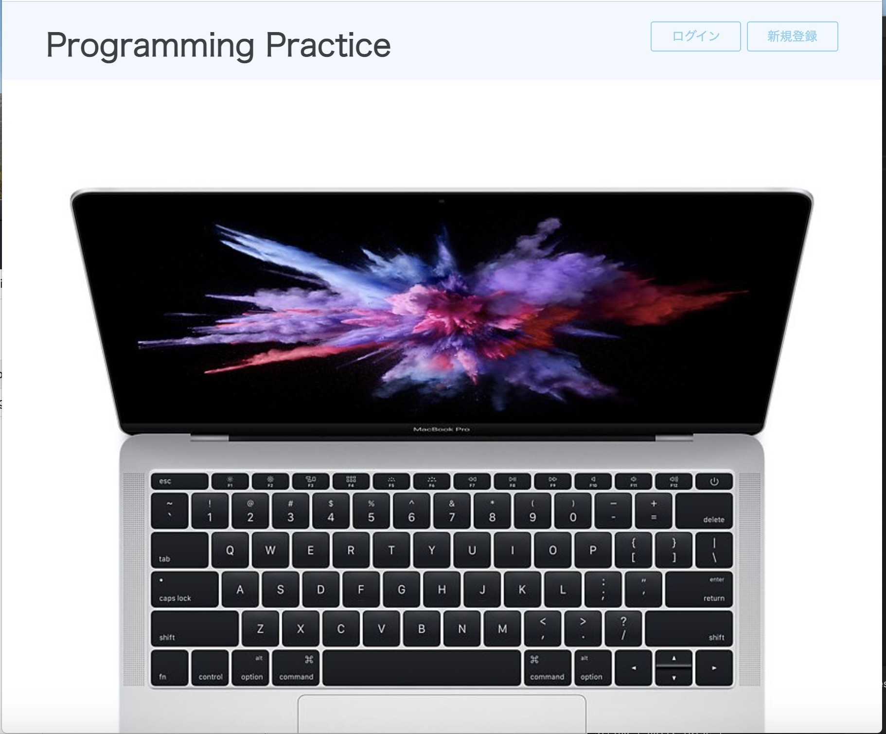

# アプリ名：
Programming Practice

# 概要：
プログラミングやITのことが学習できるアプリケーションです。

## 本番環境:
https://programming-practice-1421.herokuapp.com/

## 制作背景(意図)：
ITエンジニアを目指す方に無料で学習出来るサイトが必要だと感じたため。

## DEMO

## 工夫したポイント:
登録されている問題を解くことが出来る。
問題を作成、編集、削除、一覧、出来る。

## 使用技術(開発環境)
### マークアップ言語
HTML,CSS

### サーバーサイド
Ruby,Ruby on Rails

### データベース
MySQL

### ツール
Git,GitHub,Heroku,Sequel Pro,Trello

## 課題や今後実装したい機能
採点機能を実装して行きたいです。

# DB設計

## users テーブル

| Column     | Type   | Options     |
| ---------- | ------ | ----------- |
| nickname   | string | null: false |
| email      | string | null: false |
| password   | string | null: false |

### Association

- has_many :comments
- has_many :prototypes

## questions テーブル

| Column     | Type         | Options     |
| ---------- | ------------ | ----------- |
| title      | string       | null: false |
| content    | string       | null: false |
| option1    | string       | null: false |
| option2    | string       | null: false |
| option3    | string       | null: false |
| option4    | string       | null: false |
| user       | references   |             |

### Association

- belongs_to :users
- has_many :comments

## comments テーブル

| Column    | Type       | Options     |
| --------- | ---------- | ----------- |
| text      | text       | null: false |
| user      | references |             |
| question  | references |             |

### Association

- belongs_to :users
- belongs_to :questions